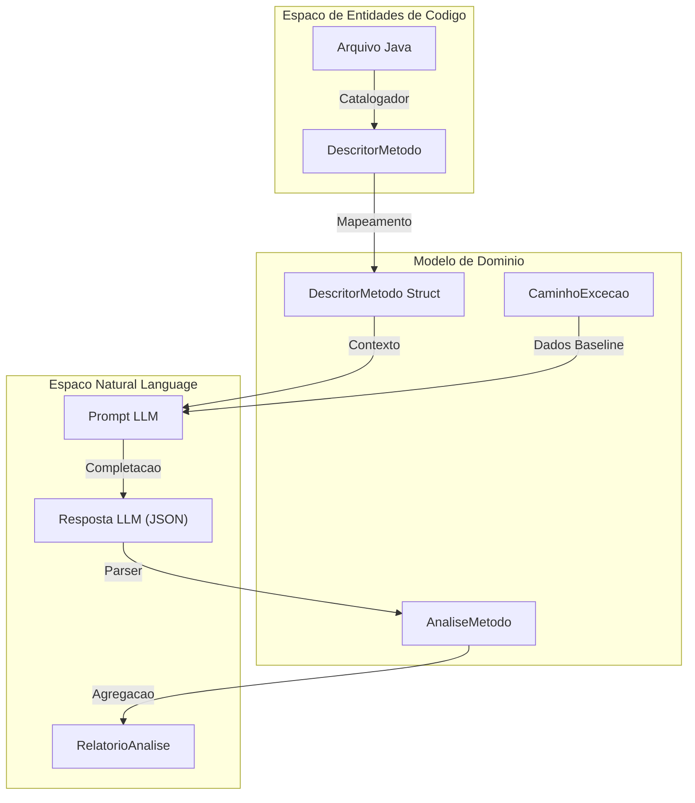

# Modelo de Dominio

O Modelo de Dominio representa a logica de negocio central e as estruturas de dados do pipeline. E definido primariamente no pacote `internal/dominio` e serve como a "Linguagem do Sistema".

O dominio e estruturado para suportar um pipeline multi-estagio: **Catalogacao** → **Analise** → **Geracao** → **Avaliacao** → **Consolidacao**.

## Estruturas de Dados Centrais

### Representacao de Metodos e Excecoes

- **`DescritorMetodo`**: Representa um metodo Java unico. Inclui pacote, classe, assinatura e caminho do arquivo fonte.
- **`CaminhoExcecao`**: Representa um caminho de execucao especifico que leva a uma excecao. E a unidade de trabalho para geracao de testes.

### Artefatos do Pipeline

| Estrutura | Proposito |
| :--- | :--- |
| `AnaliseMetodo` | Raciocinio do LLM sobre um metodo, incluindo cenarios de excecao identificados |
| `RelatorioAnalise` | Colecao de `AnaliseMetodo`, resultado da fase de Analise |
| `RelatorioGeracao` | Rastreia resultados da geracao de testes, mapeando metodos a caminhos de arquivos |
| `RelatorioAvaliacao` | Metricas de execucao (cobertura, mutacao, sucesso) para uma suite de testes |

## Fluxo de Dados

## Variantes Experimentais

O dominio define tres variantes para comparacao:

1. **`WITUP_ONLY`**: Usa apenas dados baseline da ferramenta WITUP
2. **`LLM_ONLY`**: Usa apenas analise independente do LLM
3. **`WITUP_PLUS_LLM`**: Abordagem combinada com contexto WITUP + refinamento LLM

## Funcoes Utilitarias

- **`taxaFloatSegura`**: Previne divisao por zero ao calcular taxas de sucesso
- **`taxaSucessoMetricas`**: Converte lista de resultados booleanos em percentual
- **`deltaPontuacoes`**: Subtrai dois ponteiros float nulaveis com seguranca
