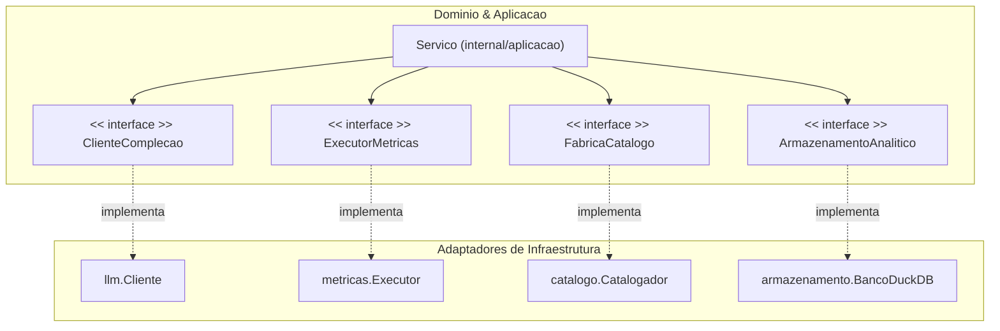

# Arquitetura

O `witup-llm` e construido usando uma arquitetura **Ports and Adapters** (Hexagonal). Este design desacopla a logica de negocio central da infraestrutura externa como provedores LLM, sistema de arquivos e banco de dados analitico.

## Estrutura de Pacotes

| Pacote | Papel | Entidades Chave |
| :--- | :--- | :--- |
| `internal/dominio` | **Camada de Dominio**: Estruturas de dados puras. Sem dependencias externas. | `DescritorMetodo`, `RelatorioAnalise`, `ConfigAplicacao` |
| `internal/aplicacao` | **Camada de Aplicacao**: Orquestra fluxos do pipeline. Define interfaces (Ports). | `Servico`, `ClienteComplecao` (Port), `ExecutorMetricas` (Port) |
| `internal/llm` | **Infraestrutura**: Implementa comunicacao LLM. | `Cliente`, `CompletarJSON` |
| `internal/agentes` | **Infraestrutura**: Implementa logica multi-agente. | `Orquestrador`, `Arqueologo`, `Cetico` |
| `internal/armazenamento` | **Infraestrutura**: Gerencia persistencia e views SQL. | `BancoDuckDB`, `RegistrarArtefatoExecucao` |
| `internal/catalogo` | **Infraestrutura**: Escaneia codigo-fonte Java. | `Catalogador`, `Catalogar` |
| `internal/metricas` | **Infraestrutura**: Executa Maven/JaCoCo/PIT. | `Executor`, `ExecutarTodas` |
| `internal/artefatos` | **Cross-cutting**: Gerencia layout do `EspacoTrabalho`. | `EspacoTrabalho`, `EscreverJSON` |

## Grafo de Dependencias

## Subsistemas Principais

### 1. Modelo de Dominio e Configuracao
Centraliza todas as estruturas de dados usadas no pipeline. Garante que o `Servico` pode passar um `RelatorioAnalise` da fase de analise para a fase de geracao sem conhecer o formato de armazenamento subjacente.

[:octicons-arrow-right-24: Modelo de Dominio](domain-model.md)

### 2. Servico de Aplicacao e Orquestracao
O struct `Servico` implementa os workflows primarios: `Analisar`, `AnalisarMultiagentes`, `Gerar` e `Avaliar`.

[:octicons-arrow-right-24: Camada de Servico](service-layer.md)

### 3. Baseline WITUP e Alinhamento
Subsistema especializado que gerencia a ingestao de baselines JSON do WITUP e alinha ao codigo-fonte atual.

[:octicons-arrow-right-24: Alinhamento WITUP](witup-alignment.md)
