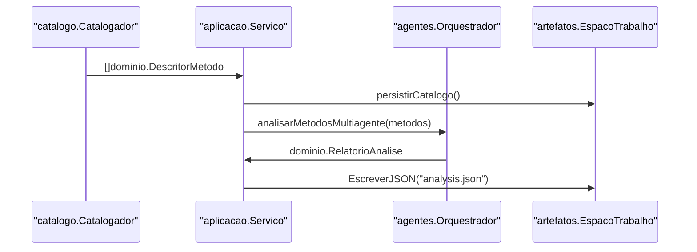

# Camada de Servico de Aplicacao

O `Servico` em `internal/aplicacao` e o orquestrador central do pipeline. Ele coordena todas as fases do experimento usando interfaces (ports) para se comunicar com a infraestrutura.

## Responsabilidades

O `Servico` foi dividido em arquivos focados seguindo o principio de responsabilidade unica:

| Arquivo | Responsabilidade |
| :--- | :--- |
| `servico.go` | Orquestracao principal, analise e geracao |
| `servico_avaliacao.go` | Avaliacao de testes (sandbox, metricas) |
| `servico_estudo.go` | Consolidacao de estudos e comparacao de variantes |
| `servico_benchmark.go` | Logica de benchmark padronizado |

## Interfaces (Ports)

```go
// ClienteComplecao - porta para comunicacao LLM
type ClienteComplecao interface {
    CompletarJSON(ctx, prompt, opcoes) (*Resposta, error)
}

// ExecutorMetricas - porta para execucao de metricas
type ExecutorMetricas interface {
    ExecutarTodas(configs, contexto) ([]ResultadoMetrica, error)
}

// FabricaCatalogo - porta para catalogacao de projetos
type FabricaCatalogo interface {
    NovoCatalogo(config) (CatalogoMetodos, error)
}

// ArmazenamentoAnalitico - porta para persistencia
type ArmazenamentoAnalitico interface {
    RegistrarArtefatoExecucao(artefato) error
    CarregarRelatorioBaseline(chave) (*RelatorioAnalise, error)
}
```

## Fluxo de Dados: Da Fonte a Analise



## Interacoes entre Subsistemas

| Interacao | Descricao |
| :--- | :--- |
| **Catalogacao** | `Servico` usa `FabricaCatalogo` para escanear `ConfigProjeto.Raiz` |
| **Analise** | `Servico` envia `DescritorMetodo` a `ClienteComplecao` para obter `CaminhoExcecao` |
| **Persistencia** | `Servico` registra resultados em `ArmazenamentoAnalitico` (DuckDB) |
| **Metricas** | `Servico` passa testes gerados a `ExecutorMetricas` para execucao JaCoCo/PIT |
