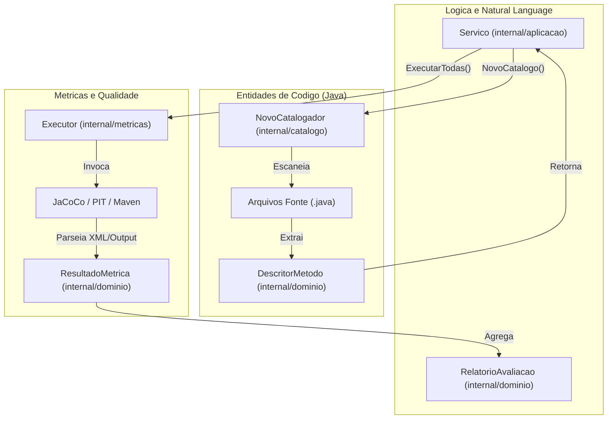

# Catalogacao e Metricas

O sistema usa dois componentes internos principais: o **Catalogador**, que descobre entidades de codigo-fonte, e o **Executor de Metricas**, que executa ferramentas externas para produzir scores quantitativos.

## Interacao dos Componentes

## Catalogador Java

O `Catalogador` escaneia o diretorio do projeto-alvo para identificar metodos Java elegiveis para analise e geracao de testes.

### Responsabilidades

- **Descoberta de Metodos**: Escaneia `.java` para identificar classes, metodos, assinaturas e corpo
- **Visao Geral do Projeto**: Fornece resumo da estrutura para contexto LLM via `CarregarVisaoGeral`
- **Filtragem**: Respeita caminhos de inclusao/exclusao definidos em `ConfigProjeto`

## Fluxo de Dados

| Fase | Componente | Entrada | Saida |
| :--- | :--- | :--- | :--- |
| **Descoberta** | `Catalogador` | Caminho no sistema de arquivos | `[]DescritorMetodo` |
| **Geracao** | `Servico` | `DescritorMetodo` + LLM | Arquivos de teste gerados |
| **Execucao** | `Executor` | Arquivos de teste | Relatorios (XML/Stdout) |
| **Extracao** | `Executor` | Relatorios | `[]ResultadoMetrica` |
| **Consolidacao** | `Servico` | `[]ResultadoMetrica` | `RelatorioAvaliacao` |

Detalhes do executor em: [Executor de Metricas](metrics.md)
