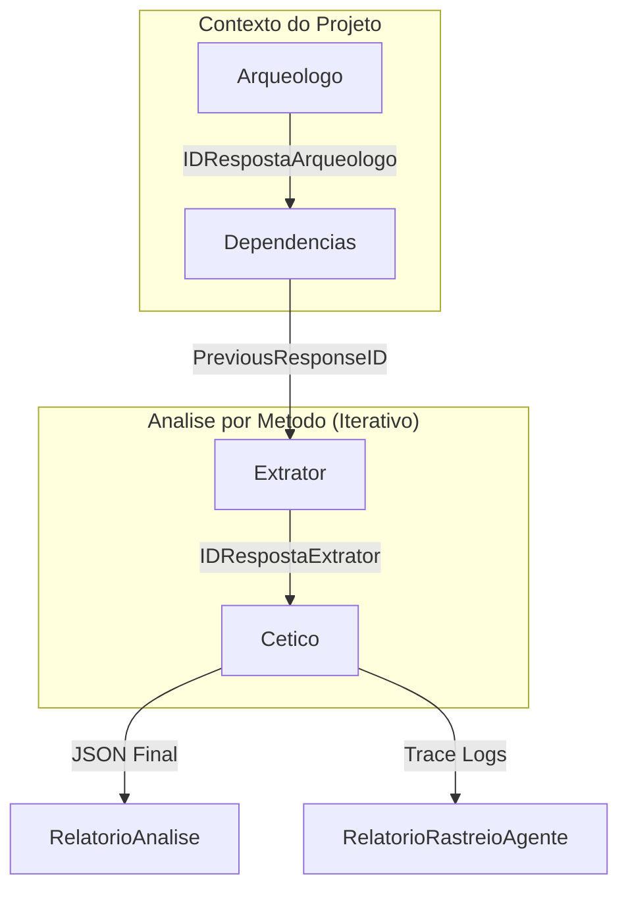

# Comandos de Analise

Os comandos de analise representam o primeiro estagio do pipeline. Sua responsabilidade e escanear um projeto Java, descobrir metodos-alvo e usar LLMs para identificar caminhos potenciais de excecao.

## 1. Analise Direta (`analisar`)

Executa um scan linear do projeto. Cada metodo e enviado ao LLM com um prompt de sistema e usuario.

### Fluxo de Execucao

1. **Descoberta de Metodos**: O `Servico` usa o `Catalogador` para encontrar metodos Java
2. **Setup do Workspace**: Cria diretorio com prefixo `analyze-[modelKey]`
3. **Construcao de Prompts**: Monta prompt com visao geral do projeto e codigo do metodo
4. **Interacao LLM**: Envia prompts ao modelo configurado
5. **Persistencia**: Salva resultado como `analysis.json` e registra no DuckDB

### Artefatos Produzidos

| Artefato | Caminho | Descricao |
| :--- | :--- | :--- |
| `analysis.json` | `[workspace]/analysis.json` | `RelatorioAnalise` com todos os ExPaths descobertos |
| `metodos.json` | `[workspace]/metodos.json` | Catalogo de metodos antes do processamento LLM |

## 2. Analise Multi-Agente (`analisar-multiagentes`)

Implementa uma cadeia de raciocinio sofisticada com papeis especializados para superar limitacoes de janela de contexto e tendencias de "alucinacao" do LLM.

### Papeis dos Agentes

1. **Arqueologo**: Analisa estrutura do projeto e arquitetura geral
2. **Dependencias**: Mapeia dependencias interprocedurais e bibliotecas externas
3. **Extrator**: Analise profunda de metodo especifico para identificar ExPaths
4. **Cetico**: Revisa achados do Extrator, reduzindo falsos positivos

### Fluxo de Estado

### Artefatos Produzidos

| Artefato | Caminho | Descricao |
| :--- | :--- | :--- |
| `analysis.json` | `[workspace]/analysis.json` | ExPaths validados |
| `agent-trace-report.json` | `[workspace]/agent-trace-report.json` | Historico completo de conversas dos agentes |
| `metodos.json` | `[workspace]/metodos.json` | Catalogo de metodos |
