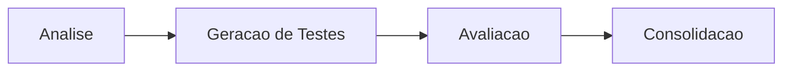
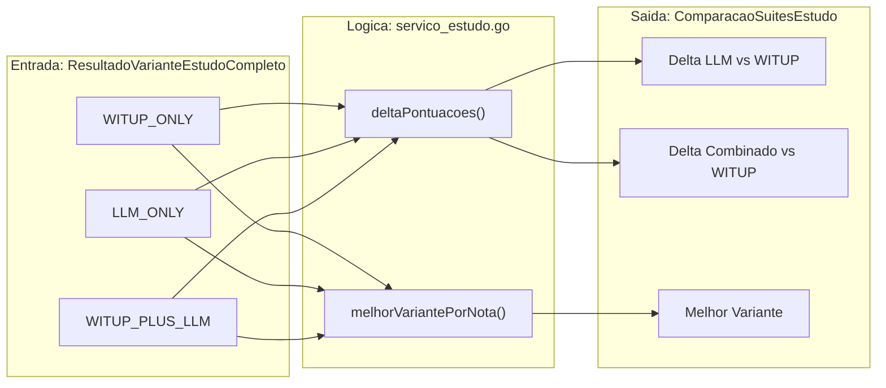

# Experimento e Estudo

Comandos de alto nivel que automatizam a comparacao entre baseline WITUP e resultados gerados por LLM.

## `executar-experimento`

Executa a logica de comparacao das tres variantes: `WITUP_ONLY`, `LLM_ONLY` e `WITUP_PLUS_LLM`. Gerencia o alinhamento do baseline WITUP ao codigo-fonte local.

### Pipeline

1. Carrega baseline WITUP do DuckDB
2. Alinha metodos do baseline ao catalogo local (resolucao de linhas)
3. Executa analise para cada variante
4. Compara ExPaths usando metricas estruturais
5. Persiste resultados comparativos no DuckDB

## `executar-estudo-completo`

Comando principal de pesquisa. Executa o ciclo completo:

Para cada variante, o sistema:

1. Analisa o projeto (descobre ExPaths)
2. Gera testes JUnit baseados nos ExPaths
3. Avalia os testes via metricas configuradas
4. Consolida resultados no DuckDB

## `consolidar-estudo`

Agrega artefatos dispersos de uma execucao em um resumo unico para ingestao no DuckDB. Calcula:

- `taxaSucessoMetricas`: Converte resultados booleanos em percentual
- `deltaPontuacoes`: Diferenca segura entre variantes (trata `nil`)
- `melhorVariantePorNota`: Determina vencedor por pontuacao ponderada

### Logica de Comparacao

