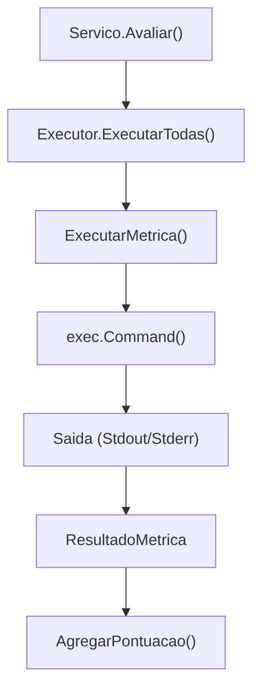

# Geracao, Avaliacao e Benchmark

Comandos da "Fase 2": transformam ExPaths identificados em codigo Java executavel e medem sua qualidade.

## `gerar`

Recebe um relatorio de analise e produz arquivos de teste JUnit. Usa templates para garantir que o LLM siga as convencoes de teste do projeto.

### Processo

1. Carrega `RelatorioAnalise` do workspace
2. Para cada metodo com ExPaths, monta prompt com contexto do codigo
3. LLM gera arquivo de teste JUnit
4. Sistema valida e salva no workspace

### Artefatos

| Artefato | Descricao |
| :--- | :--- |
| `tests/*.java` | Arquivos de teste JUnit gerados |
| `generation-report.json` | Mapeamento metodo → arquivo gerado |

## `avaliar`

Orquestra a execucao de `mvn test`, relatorios JaCoCo e analise de mutacao PIT.

### Metricas Coletadas

| Metrica | Ferramenta | Descricao |
| :--- | :--- | :--- |
| Execucao de testes | Maven Surefire | Testes passam/falham |
| Cobertura de linha | JaCoCo | Percentual de linhas cobertas |
| Cobertura de branch | JaCoCo | Percentual de branches cobertos |
| Score de mutacao | PIT | Percentual de mutantes mortos |
| Reproducao de excecao | Custom | Verifica se a excecao prevista foi lancada |

### Pipeline de Avaliacao

## `executar-benchmark`

Comando especializado para executar avaliacoes padronizadas contra benchmarks conhecidos, ranqueando performance de modelos.
