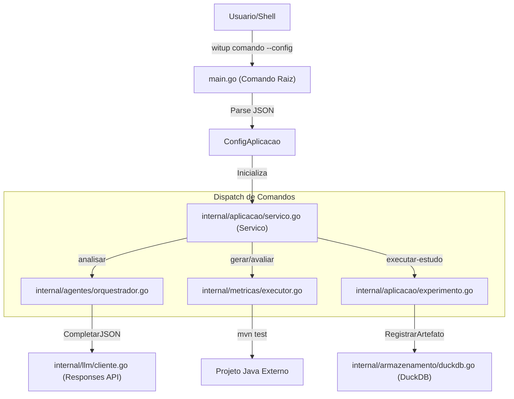

# CLI e Referencia de Comandos

O binario `witup` e a interface principal para orquestrar o pipeline de pesquisa. Ele traduz comandos de alto nivel em chamadas ao `Servico` da camada de aplicacao.

## Arquitetura de Dispatch

## Mapeamento de Comandos

| Comando CLI | Metodo Principal | Proposito |
| :--- | :--- | :--- |
| `analisar` | `AnalisarProjeto` | Scan direto via LLM dos metodos |
| `analisar-multiagentes` | `AnalisarMultiagentes` | Orquestracao multiagente com papeis especializados |
| `gerar` | `GerarTestes` | Cria testes JUnit a partir de artefatos de analise |
| `avaliar` | `AvaliarProjeto` | Executa Maven/JaCoCo/PIT nos testes gerados |
| `executar-experimento` | `ExecutarExperimento` | Pipeline de comparacao de tres variantes |
| `executar-estudo-completo` | `ExecutarEstudoCompleto` | Pipeline completo: Analise + Geracao + Avaliacao |
| `consolidar-estudo` | `ConsolidarEstudo` | Agrega artefatos em resumo para DuckDB |
| `sondar` | `Sondar` | Verifica conectividade com provedor LLM |
| `ingerir-witup` | `IngerirWITUP` | Importa baselines WITUP para DuckDB |
| `visualizar-dados` | `VisualizarDados` | Servidor web local para explorar resultados |

## Categorias de Comandos

- [Comandos de Analise](analysis.md) — Descoberta de ExPaths via LLM
- [Experimento e Estudo](experiment.md) — Orquestracao do protocolo experimental
- [Geracao, Avaliacao e Benchmark](generation.md) — Producao e medicao de testes
- [Utilitarios](utilities.md) — Ferramentas auxiliares
