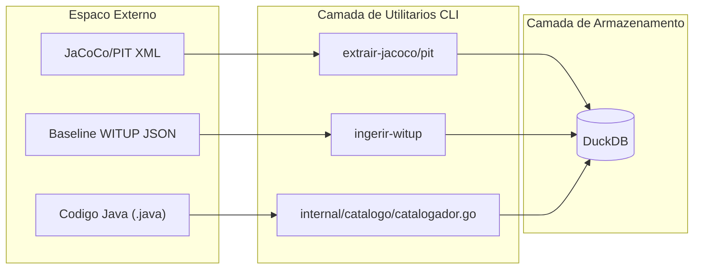

# Utilitarios

Ferramentas auxiliares para validacao de ambiente, gestao de dados e visualizacao.

## `sondar`

Probe de conectividade para verificar que o LLM configurado (OpenAI ou Ollama) esta respondendo corretamente.

- **OpenAI**: Chama `/models` para listar modelos disponiveis
- **Ollama**: Chama `/api/tags` para listar modelos locais

```bash
./bin/witup sondar --config pipeline.json
```

## `ingerir-witup`

Importa o baseline original WITUP de arquivos JSON para a instancia DuckDB local.

```bash
./bin/witup ingerir-witup --config pipeline.json
```

## `visualizar-dados`

Inicia um servidor web local (porta padrao 8421) para explorar as views analiticas do DuckDB.

```bash
./bin/witup visualizar-dados --config pipeline.json
```

### Endpoints

| Endpoint | Descricao |
| :--- | :--- |
| `/api/objetos` | Lista todas as tabelas e views |
| `/api/consulta` | Executa queries SQL (somente leitura) |
| `/api/execucoes` | Lista execucoes recentes |

## `extrair-jacoco`

Parser standalone que converte relatorios XML do JaCoCo para o formato interno de metricas.

## `extrair-pit`

Processa resultados de testes de mutacao do PIT, identificando quais testes gerados mataram mutantes com sucesso.

## `medir-reproducao-excecoes`

Utilitario especializado que executa suites de teste geradas e verifica se o tipo de excecao previsto (ex: `NullPointerException`) foi realmente lancado durante a execucao.

## Resumo

| Comando | Funcao Principal |
| :--- | :--- |
| `sondar` | Health check de conectividade |
| `ingerir-witup` | Popular DuckDB com baselines |
| `visualizar-dados` | Iniciar Web UI para resultados |
| `extrair-jacoco` | Parsear relatorios de cobertura |
| `extrair-pit` | Parsear relatorios de mutacao |
| `medir-reproducao` | Verificar triggers de excecao |


