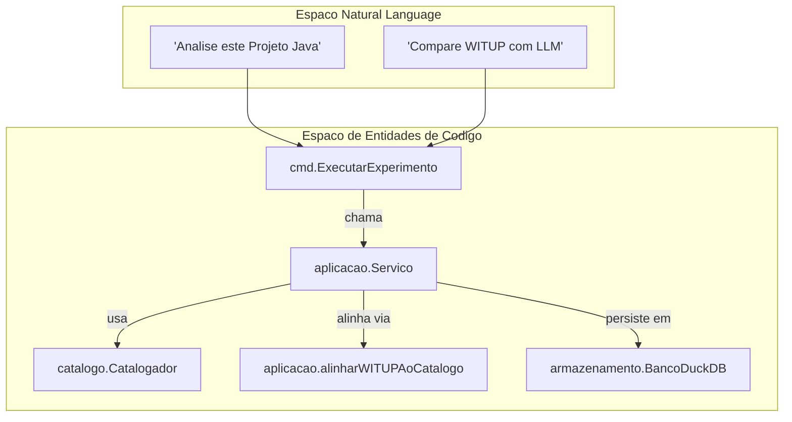
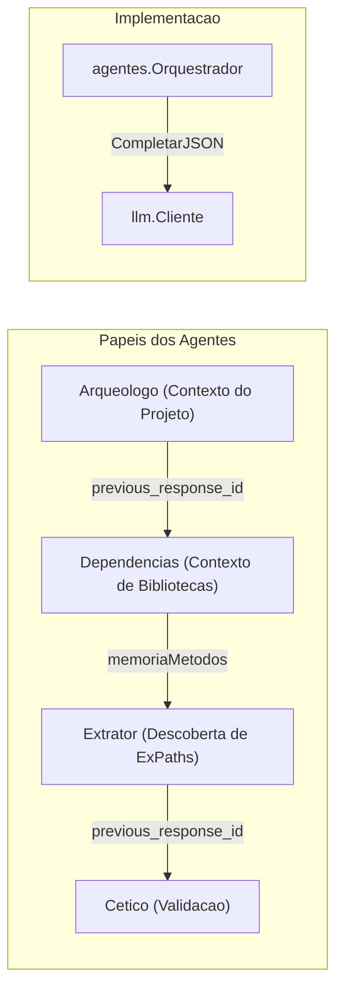

# Glossario

Definicoes para terminologia de dominio, identificadores em portugues e abreviacoes tecnicas usadas no `witup-llm`.

## Conceitos de Dominio e Variantes

| Termo | Definicao |
| :--- | :--- |
| **WITUP** | Ferramenta de pesquisa (baseline) que usa analise estatica para identificar exception paths em codigo Java |
| **ExPath** | Abreviacao de "Exception Path". Representa um fluxo de execucao especifico que leva a uma excecao |
| **WITUP_ONLY** | Variante experimental usando apenas dados baseline do pacote de replicacao WITUP |
| **LLM_ONLY** | Variante experimental onde ExPaths sao descobertos exclusivamente por um Large Language Model |
| **WITUP_PLUS_LLM** | Variante experimental que combina baseline WITUP com refinamentos e novas descobertas do LLM |

## Mapeamento de Identificadores Portugues

| Identificador | Equivalente em Ingles | Contexto |
| :--- | :--- | :--- |
| `AnaliseMetodo` | Method Analysis | Estrutura com ExPaths para um unico metodo |
| `CaminhoExcecao` | Exception Path (ExPath) | Unidade central de analise descrevendo um fluxo de excecao |
| `DescritorMetodo` | Method Descriptor | Metadados sobre um metodo Java (classe, assinatura, linhas) |
| `RelatorioAnalise` | Analysis Report | Colecao de `AnaliseMetodo` para um projeto |
| `EspacoTrabalho` | Workspace | Gerenciador do layout no sistema de arquivos para uma execucao |
| `Sondar` | Probe | Verificacao de conectividade com endpoints LLM |
| `Alvos` | Targets | Subconjunto de metodos selecionados para analise/geracao |

## Termos de Integracao LLM

| Termo | Definicao |
| :--- | :--- |
| **Responses API** | Interface OpenAI-compativel para interacoes stateful e cache de prompts |
| **Prompt Cache Key** | String deterministica que permite ao provedor LLM reusar estado interno para prompts identicos |
| **Multi-Agent Orchestrator** | Sistema que encadeia multiplas chamadas LLM com papeis diferentes para refinar resultados |
| **previous_response_id** | ID de resposta anterior para encadeamento stateful entre chamadas |

## Termos de Dados e Armazenamento

| Termo | Definicao |
| :--- | :--- |
| **Armazenamento Analitico** | Instancia DuckDB para armazenar resultados de experimentos e baselines |
| **Alinhamento de Baseline** | Processo de mapear metodos dos JSON de pesquisa ao codigo-fonte local |
| **Sandbox** | Ambiente Java efemero para execucao segura de testes |
| **EspacoTrabalho** | Isolamento baseado em diretorio para artefatos de experimento |

## Definicoes de Metricas

| Identificador | Descricao |
| :--- | :--- |
| `cobertura_jacoco` | Percentual de linhas/branches cobertos pelo teste gerado |
| `mutacao_pit` | Score de mutacao indicando quantos "mutantes" a suite matou |
| `reproducao_excecao` | Se o teste disparou a excecao esperada |
| `NotaMetricas` | Media ponderada de todas as metricas ativas para uma variante |
| `NotaCombinada` | Score final balanceando cobertura, mutacao e reproducao |

## Diagrama: Fluxo de Analise

## Diagrama: Papeis dos Agentes

