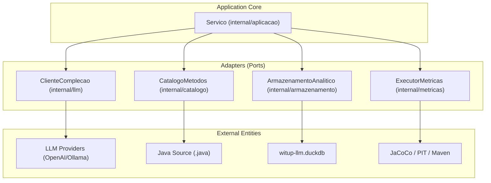

# witup-llm

**CLI em Go para pesquisa sobre geração e validação de exception paths em projetos Java.**

`witup-llm` facilita a comparação entre análise estática tradicional (WITUP) e abordagens baseadas em Large Language Models (LLM) para descoberta de fluxos de tratamento de erros e geração de testes unitários.

O sistema atua como um harness experimental que gerencia catalogação de projetos, orquestração de LLM, execução de métricas (como cobertura JaCoCo e mutação PIT), e persistência analítica em DuckDB.

## Objetivos da Pesquisa

O objetivo principal é executar um protocolo de pesquisa que compara três variantes experimentais:

| Variante | Descrição |
| :--- | :--- |
| `WITUP_ONLY` | Exception paths extraídos do pacote de replicação WITUP original. |
| `LLM_ONLY` | Exception paths descobertos exclusivamente por um LLM (modo `direct` ou `multiagent`). |
| `WITUP_PLUS_LLM` | Conjunto refinado combinando descoberta WITUP com validação/refinamento LLM. |

O protocolo avalia estas variantes em duas dimensões: a qualidade dos `expaths` gerados e a qualidade das suítes de testes unitários derivadas desses caminhos.

## Arquitetura do Sistema

## Subsistemas Principais

- **Orquestração LLM**: Suporta scanning `direct` (uma chamada por método) e fluxo `multiagent` com papéis especializados como `Arqueólogo` e `Cético` para validação profunda.
- **Catalogação de Projetos**: Scanner baseado em regex que identifica métodos Java e fornece visão geral do projeto para contexto LLM.
- **Armazenamento Analítico**: Usa DuckDB para armazenar baselines, artefatos de execução e gráficos gerados para consolidação de estudos.
- **Execução de Métricas**: Orquestra ferramentas externas como Maven para medir cobertura de testes (JaCoCo) e scores de mutação (PIT).

## Navegação Rápida

-   :rocket:{ .lg .middle } **Primeiros Passos**

    ---

    Instruções para configurar Go, Java e DuckDB para rodar seu primeiro experimento.

    [**Começar &rarr;**](overview/getting-started.md)

-   :gear:{ .lg .middle } **Configuração**

    ---

    Detalhamento da estrutura `pipeline.json` e objetos de configuração.

    [**Ver referência &rarr;**](overview/configuration.md)

-   :computer:{ .lg .middle } **Comandos CLI**

    ---

    Referência completa dos comandos disponíveis.

    [**Ver comandos &rarr;**](cli/index.md)

-   :building_construction:{ .lg .middle } **Arquitetura**

    ---

    Ports and Adapters, modelo de domínio e camada de serviço.

    [**Explorar &rarr;**](architecture/index.md)

-   :robot:{ .lg .middle } **Integração LLM**

    ---

    Cliente OpenAI, Responses API e orquestrador multi-agente.

    [**Ver detalhes &rarr;**](llm/client.md)

-   :floppy_disk:{ .lg .middle } **Armazenamento**

    ---

    Schema DuckDB, views analíticas e visualização de resultados.

    [**Ver schema &rarr;**](storage/index.md)

