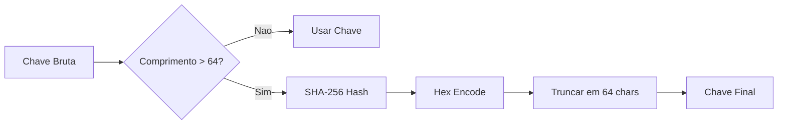

# Cliente LLM

O `Cliente` em `internal/llm/cliente.go` e o adaptador de infraestrutura responsavel por toda comunicacao com provedores LLM. Ele suporta OpenAI (via Responses API) e Ollama (local).

## Provedores Suportados

| Provedor | Endpoint | Caso de Uso |
| :--- | :--- | :--- |
| **OpenAI** | `POST /v1/responses` | Producao — suporta stateful chaining e prompt caching |
| **Ollama** | `POST /api/generate` | Desenvolvimento local — sem custo de API |

## Responses API (OpenAI)

O cliente usa a Responses API para interacoes stateful e cache de prompts.

### Campos Principais do Request

| Campo | Proposito |
| :--- | :--- |
| `model` | Modelo a ser usado |
| `instructions` | System prompt |
| `input` | User prompt |
| `text.format` | `json_schema` para respostas estruturadas |
| `previous_response_id` | Encadeia com resposta anterior (sessao stateful) |
| `store` | Armazena resposta no servidor para referencia futura |
| `reasoning.effort` | Nivel de raciocinio (`low`, `medium`, `high`) |

### Normalizacao de Prompt Cache Key

Para garantir alta taxa de cache hits dentro dos limites do provedor (geralmente 64 caracteres), o cliente normaliza chaves de cache:

## Retry e Backoff

O metodo `requestJSON` implementa backoff exponencial. So faz retry em codigos de status especificos:

| Feature | Implementacao |
| :--- | :--- |
| **Codigos Retentaveis** | 408, 409, 425, 429, 500, 502, 503, 504 |
| **Estrategia de Espera** | 2^tentativa x 500ms (max 60s) |
| **Retry-After** | Respeita header `Retry-After` (cap em 5 minutos) |
| **Timeout** | Por requisicao, via `ConfigModelo.SegundosTimeout` |
| **Fallback** | Se `previous_response_id` expirar, retenta sem o ID |

## Estruturas Internas

### Struct `Cliente`

- `httpClient`: `*http.Client` para todas as requisicoes

### Struct `Resposta`

- `IDResposta`: ID unico do provedor (para encadeamento stateful)
- `Payload`: Objeto JSON desmarshalizado
- `RawText`: Texto completo antes da extracao

## Probe de Conectividade (`Sondar`)

- **OpenAI**: Chama `/models` para listar modelos disponiveis
- **Ollama**: Chama `/api/tags` para listar modelos locais
