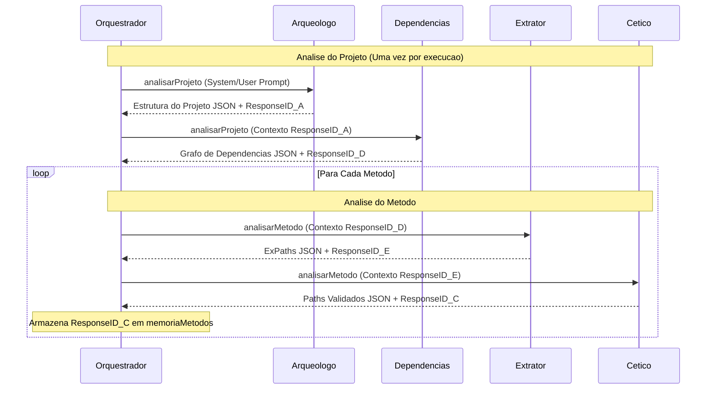

# Orquestrador Multi-Agente

O `Orquestrador` em `internal/agentes/servico.go` decompoe a tarefa complexa de analise de software em papeis especializados, mantendo contexto stateful entre chamadas LLM.

## Arquitetura

| Componente | Descricao |
| :--- | :--- |
| `Orquestrador` | Gerencia ciclo de vida dos agentes e `memoriaMetodos` |
| `ExecutorAgenteJSON` | Funcao que conecta o orquestrador ao cliente LLM |
| `memoriaMetodos` | Mapa que armazena `PreviousResponseID` para referencia cruzada entre metodos |

## Fluxo de Execucao

## Papeis dos Agentes

### 1. Arqueologo
- **Proposito**: Analisa estrutura do projeto e identifica responsabilidades dos metodos-alvo
- **Entrada**: Visao geral do projeto + lista de descritores de metodos
- **Saida**: Mapeamento de modulos e insights arquiteturais

### 2. Dependencias
- **Proposito**: Mapeia relacionamentos e grafos de chamada entre metodos e bibliotecas externas
- **Entrada**: Visao geral do projeto + saida do Arqueologo
- **Saida**: Arvores de dependencia e contexto interprocedural

### 3. Extrator
- **Proposito**: Analise profunda de metodo especifico para identificar ExPaths
- **Entrada**: Codigo-fonte do metodo + contexto compartilhado do projeto
- **Saida**: Lista de `CaminhoExcecao`

### 4. Cetico
- **Proposito**: Portao de qualidade — desafia achados do Extrator para reduzir alucinacoes
- **Entrada**: Saida do Extrator
- **Saida**: Conjunto refinado e validado de ExPaths

## Encadeamento Stateful e Memoria

O orquestrador mantém estado usando `PreviousResponseID`:

1. **Contexto do Projeto**: `Dependencias` recebe `IDResposta` do `Arqueologo`
2. **Contexto do Metodo**: `Extrator` referencia `IDResposta` do `Dependencias`
3. **Contexto de Refinamento**: `Cetico` referencia `IDResposta` do `Extrator`

### Contexto Interprocedural (`memoriaMetodos`)

Para suportar analise onde um metodo chama outro, o orquestrador armazena o `ResponseID` final de cada metodo processado em `memoriaMetodos`. Quando um novo metodo e analisado, verifica se suas dependencias ja foram analisadas e pode injetar esses IDs na cadeia.

## Resiliencia e Fallbacks

Se uma chamada falha porque o `PreviousResponseID` expirou, o orquestrador:

1. Registra a falha no log
2. Retenta a execucao **sem** o `PreviousResponseID`, efetivamente "resetando" a sessao enquanto ainda fornece contexto via `userPrompt`

## Artefatos Produzidos

| Artefato | Descricao |
| :--- | :--- |
| `RelatorioAnalise` | ExPaths validados finais para cada metodo |
| `RelatorioRastreioAgente` | Trace detalhado de cada interacao de agente |
