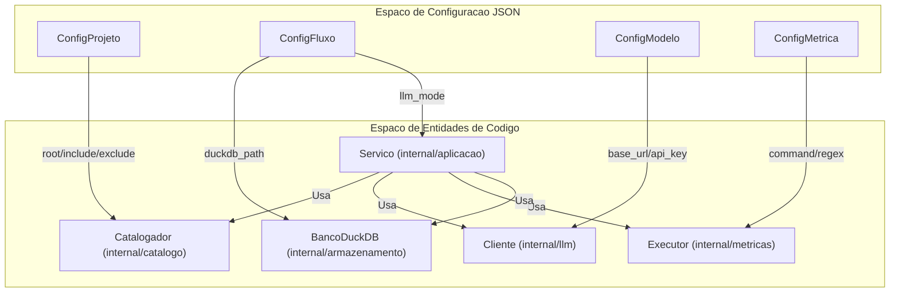

# Referencia de Configuracao

O `witup-llm` usa um arquivo JSON (`pipeline.json`) como configuracao central. Ele define o projeto-alvo, o fluxo experimental, os modelos LLM e as metricas de avaliacao.

## Estrutura Geral

```json
{
  "projeto": { ... },
  "fluxo": { ... },
  "modelos": { ... },
  "metricas": [ ... ]
}
```

## 1. Configuracao do Projeto (`ConfigProjeto`)

Define o projeto Java a ser analisado.

| Campo | Tipo | Descricao |
| :--- | :--- | :--- |
| `root` | `string` | Caminho absoluto para a raiz do projeto Java |
| `include_paths` | `[]string` | Padroes glob para incluir arquivos na analise |
| `exclude_paths` | `[]string` | Padroes glob para excluir (ex: `**/test/**`) |
| `build_command` | `string` | Comando para compilar o projeto (ex: `mvn compile`) |
| `baseline_file` | `string` | Caminho para o JSON do baseline WITUP |

## 2. Configuracao do Fluxo (`ConfigFluxo`)

Controla os estagios do pipeline experimental.

| Campo | Tipo | Descricao |
| :--- | :--- | :--- |
| `llm_mode` | `string` | Modo de analise: `direct` ou `multiagent` |
| `duckdb_path` | `string` | Caminho para o arquivo DuckDB |
| `replication_root` | `string` | Diretorio com os baselines WITUP |
| `workspace_root` | `string` | Diretorio raiz para artefatos gerados |
| `skip_analysis` | `bool` | Pular fase de analise (reusar artefatos existentes) |
| `skip_generation` | `bool` | Pular fase de geracao de testes |

## 3. Configuracao de Modelos (`ConfigModelo`)

Define os provedores LLM utilizados.

| Campo | Tipo | Descricao |
| :--- | :--- | :--- |
| `provider` | `string` | Provedor: `openai` ou `ollama` |
| `model` | `string` | Modelo especifico (ex: `gpt-4o`, `llama3`) |
| `base_url` | `string` | URL do endpoint da API |
| `api_key_env` | `string` | Variavel de ambiente com a chave API |
| `temperature` | `float` | Temperatura de amostragem (geralmente `0.0` para pesquisa) |
| `timeout_seconds` | `int` | Timeout maximo por requisicao |
| `max_retries` | `int` | Numero de tentativas para erros transientes |
| `reasoning_effort` | `string` | Para modelos com raciocinio (`low`, `medium`, `high`) |

## 4. Configuracao de Metricas (`ConfigMetrica`)

Define como o codigo gerado e avaliado.

| Campo | Tipo | Descricao |
| :--- | :--- | :--- |
| `name` | `string` | Identificador unico (ex: `jacoco-line-coverage`) |
| `kind` | `string` | Tipo: `tests`, `coverage` ou `mutation` |
| `command` | `string` | Comando shell (suporta placeholders como `${TARGET_CLASSES}`) |
| `value_regex` | `string` | Regex para extrair o valor do resultado |
| `value_file` | `string` | Arquivo para ler em vez de stdout (ex: `index.html`) |
| `weight` | `float` | Peso na pontuacao agregada |

## Mapeamento Configuracao-Entidade



## Ciclo de Vida da Execucao

Quando `executar-estudo-completo` e invocado:

1. **Ingestao**: `ConfigFluxo.replication_root` carrega baselines no DuckDB
2. **Catalogacao**: `ConfigProjeto` direciona o `Catalogador` para encontrar metodos Java
3. **Geracao de Variantes**:
    - **WITUP_ONLY**: Carrega de `baseline_file`
    - **LLM_ONLY**: Chama `Cliente` usando o modelo configurado
    - **WITUP_PLUS_LLM**: Passa contexto baseline ao `Orquestrador` (Multi-agente)
4. **Avaliacao**: `ExecutorMetricas` executa todos os comandos de `ConfigMetrica`
5. **Persistencia**: Resultados sao salvos em `ConfigFluxo.duckdb_path`
