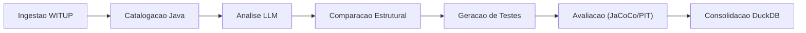

# Visao Geral

O `witup-llm` e uma ferramenta de pesquisa que automatiza a descoberta de exception paths (ExPaths) em projetos Java e compara abordagens de analise estatica (WITUP) com Large Language Models.

## Contexto da Pesquisa

O projeto surge da necessidade de avaliar se LLMs podem complementar ou superar ferramentas tradicionais de analise estatica na identificacao de fluxos de excecao em codigo Java. O baseline de referencia vem do artigo WITUP (publicado no EMSE), e o sistema executa um protocolo experimental com tres variantes.

## Pipeline do Sistema

### Etapas Principais

1. **Ingestao do Baseline**: Carrega dados do pacote de replicacao WITUP no DuckDB.
2. **Catalogacao**: Scanner baseado em regex identifica metodos Java elegiveis.
3. **Analise**: Executa descoberta de ExPaths via LLM (modo `direct` ou `multiagent`).
4. **Comparacao**: Compara ExPaths WITUP vs LLM usando metricas estruturais (Jaccard, precisao, recall).
5. **Geracao de Testes**: Produz suites JUnit a partir dos ExPaths identificados.
6. **Avaliacao**: Executa testes em sandbox isolada, mede cobertura (JaCoCo) e mutacao (PIT).
7. **Consolidacao**: Persiste resultados no DuckDB para consulta reprodutivel.

## Variantes Experimentais

| Variante | Fonte dos ExPaths | Descricao |
| :--- | :--- | :--- |
| `WITUP_ONLY` | Baseline estatico | Dados do pacote de replicacao original |
| `LLM_ONLY` | LLM independente | Descoberta exclusiva por modelo de linguagem |
| `WITUP_PLUS_LLM` | Hibrido | Baseline WITUP + refinamento/descoberta LLM |

## Hipoteses de Pesquisa

- **H1 (Descoberta)**: O LLM consegue descobrir ExPaths comparaveis ao WITUP?
- **H2 (Precisao)**: Qual a precisao estrutural dos ExPaths gerados pelo LLM?
- **H3 (Aumento)**: A combinacao WITUP+LLM supera cada abordagem isolada?
- **H4 (Complexidade)**: Como o desempenho varia com a complexidade do codigo?
