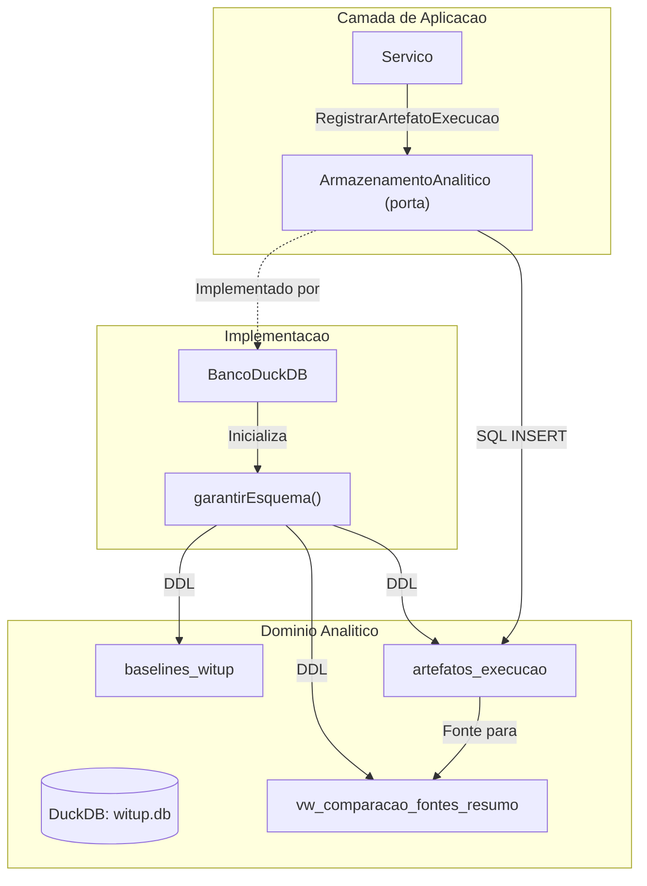

# Armazenamento Analitico e Relatorios

A camada de armazenamento analitico fornece um mecanismo centralizado para persistir resultados de experimentos, dados de baseline e artefatos de execucao. Utiliza **DuckDB** como motor analitico embarcado.

## Componentes Centrais

O nucleo e o struct `BancoDuckDB`, que gerencia o ciclo de vida do banco de dados analitico. Na inicializacao via `AbrirBancoDuckDB`, o sistema garante automaticamente a presenca do schema e views analiticas.

### Tabelas Principais

1. **`baselines_witup`**: Armazena dados de referencia da pesquisa WITUP original
2. **`artefatos_execucao`**: Registro flexivel que indexa todo artefato gerado durante uma execucao

### Fluxo de Dados

## Views Analiticas

O motor de relatorios define um **pipeline de views SQL** que extrai metricas diretamente dos payloads JSON armazenados no banco, usando a extensao JSON do DuckDB.

### Views de Hipoteses (H1–H4)

- **H1 (Descoberta)**: Avalia capacidade do LLM de descobrir ExPaths comparaveis ao baseline
- **H2 (Precisao)**: Mede precisao estrutural dos caminhos gerados pelo LLM
- **H3 (Aumento)**: Analisa como `WITUP_PLUS_LLM` melhora sobre o baseline isolado
- **H4 (Complexidade)**: Correlaciona desempenho com metricas de complexidade do codigo

## Mecanismos de Consumo

1. **Interface Web**: Servidor HTTP com console SQL e dashboards pre-construidos
2. **Graficos Terminal**: Funcao `GerarGraficosExecucao` usa `textplot` para graficos ASCII

Detalhes em:

- [Schema e Ingestao DuckDB](schema.md)
- [Views Analiticas e Visualizacao](views.md)
