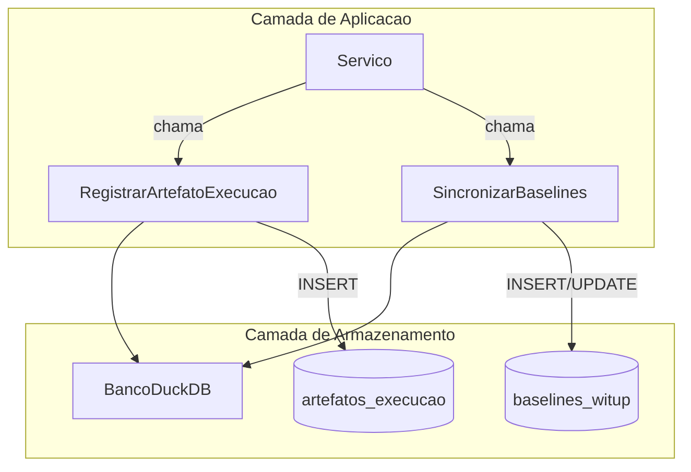

# Schema e Ingestao DuckDB

O schema e gerenciado automaticamente pelo metodo `garantirEsquema`, que executa statements `CREATE TABLE IF NOT EXISTS` e `CREATE OR REPLACE VIEW`.

## Tabelas Principais

| Tabela | Proposito | Colunas Chave |
| :--- | :--- | :--- |
| `baselines_witup` | Dados historicos do WITUP | `chave_projeto`, `nome_arquivo`, `payload_bruto_json`, `relatorio_json` |
| `artefatos_execucao` | Metadados e payloads JSON de cada artefato | `id_execucao`, `tipo_artefato`, `variante`, `caminho_arquivo`, `payload_json` |

### Constraint de Unicidade

A tabela `artefatos_execucao` possui constraint UNIQUE em `(id_execucao, tipo_artefato, variante)` com semantica `INSERT OR REPLACE` para garantir idempotencia em re-execucoes.

## Logica de Ingestao

### Sincronizacao de Baselines

`SincronizarBaselines` itera sobre um diretorio de arquivos JSON WITUP:

1. Parseia JSON bruto em `RelatorioAnalise`
2. Verifica se a combinacao projeto/arquivo ja existe em `baselines_witup`
3. Atualiza ou insere o registro com payload bruto e JSON canonicalizado

### Registro de Artefatos

`RegistrarArtefatoExecucao` e chamado sempre que o pipeline produz um arquivo significativo:

- Captura `id_execucao` para agrupar artefatos da mesma execucao
- Armazena caminho e conteudo JSON completo em `payload_json`
- Permite schema-on-read via funcoes JSON do SQL

## Fluxo de Ingestao

## Funcoes Chave

| Funcao | Descricao |
| :--- | :--- |
| `ImportarBaselineProjeto` | Converte JSON legado WITUP em `RelatorioAnalise` |
| `CarregarRelatorioBaseline` | Recupera baseline do banco por `chave_projeto` |
| `ExecutarConsultaSomenteLeitura` | Executa SQL arbitrario com validacao de seguranca (somente SELECT) |
