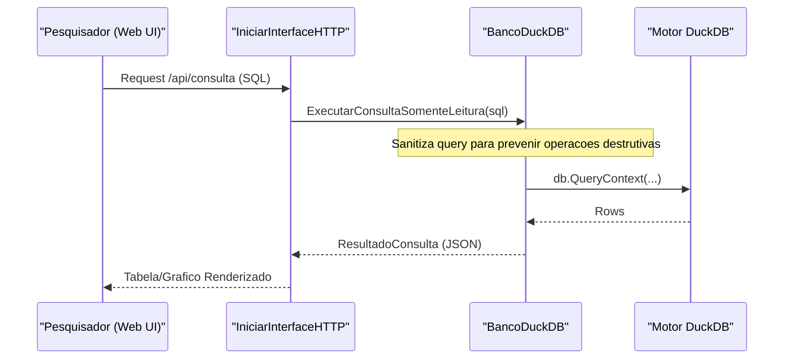

# Views Analiticas e Visualizacao

O sistema define views SQL que transformam payloads JSON brutos em estruturas relacionais planas para analise e visualizacao.

## Views de Comparacao

- **`vw_comparacao_fontes_resumo`**: Metricas de alto nivel para comparacao, incluindo contagens de metodos, ExPaths e taxas de cobertura
- **`vw_comparacao_fontes_metodo`**: Comparacao no nivel do metodo com indices Jaccard e taxas de novidade

## Views de Hipoteses (H1–H4)

| View | Hipotese | Foco |
| :--- | :--- | :--- |
| `vw_h1` | Descoberta | Capacidade do LLM de encontrar ExPaths |
| `vw_h2` | Precisao | Precisao estrutural dos ExPaths LLM |
| `vw_h3` | Aumento | Melhoria de WITUP_PLUS_LLM sobre baseline |
| `vw_h4` | Complexidade | Correlacao desempenho vs complexidade |

## Estratificacao por Complexidade

As views categorizam metodos Java em buckets de complexidade:

| Nivel | Criterio | Foco Analitico |
| :--- | :--- | :--- |
| **Simples** | 1-2 ExPaths | Acuracia de reproducao do baseline |
| **Moderado** | 3-5 ExPaths | Precisao estrutural e cobertura de branch |
| **Complexo** | >5 ExPaths | "Alucinacao" do LLM vs descoberta de caminhos ocultos |

## Interface Web

O comando `visualizar-dados` inicia um servidor HTTP local para explorar o DuckDB.

### Endpoints

| Endpoint | Descricao |
| :--- | :--- |
| `/api/objetos` | Lista tabelas e views via `ListarObjetosBanco` |
| `/api/consulta` | Executa queries SQL somente-leitura |
| `/api/execucoes` | Lista execucoes recentes |

## Visualizacao Terminal

Para ambientes CLI-only, `GerarGraficosExecucao` usa **textplot** para gerar histogramas e linhas de tendencia diretamente na saida padrao.
