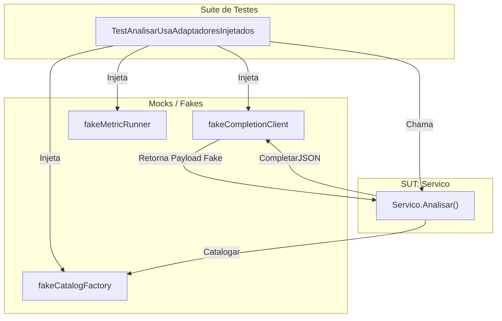

# Suite de Testes Go

A suite Go fornece verificacao automatizada da logica central, desde interacoes de baixo nivel com o cliente LLM ate orquestracao de alto nivel da aplicacao.

## Estrategia e Padroes

A base de codigo segue um padrao rigoroso centrado em injecao de dependencia e mocking de interfaces:

- **Doubles Deterministicos**: Structs customizados (ex: `fakeCompletionClient`) implementam interfaces de dominio para retornar payloads pre-definidos
- **Mocking de Interfaces**: O `Servico` e testado usando adaptadores injetados para completacao, metricas e catalogacao
- **Hijacking de RoundTrip**: Testes do cliente LLM usam `http.RoundTripper` customizado para interceptar requisicoes e verificar payloads JSON
- **Workspaces Temporarios**: Testes usam `t.TempDir()` para garantir estado limpo do sistema de arquivos

## Testes da Camada de Aplicacao

### Casos de Teste Principais

| Teste | Verifica |
| :--- | :--- |
| `TestAnalisarUsaAdaptadoresInjetados` | Servico roteia metodos para LLM e normaliza ExPaths |
| `TestGerarEscreveApenasArquivosSeguros` | Arquivos gerados sao colocados corretamente no workspace |
| `TestGerarDivideConteinerGrandeEmLotesCompactos` | Logica de batching para prevenir overflow de janela de contexto |

## Testes do Cliente LLM

| Teste | Verifica |
| :--- | :--- |
| `TestCompletarJSONUsaResponsesAPIComPromptCacheKey` | `prompt_cache_key`, `reasoning_effort` e `nivel_servico` mapeados corretamente |
| `TestCompletarJSONUsaPreviousResponseIDNaResponsesAPI` | `previous_response_id` enviado e `store` omitido quando `PreservarEstado` e true |
| `TestCompletarJSONEncurtaPromptCacheKeyLonga` | Cache keys longas automaticamente truncadas/hasheadas |

## Testes de Integracao e Utilitarios

| Pacote | Foco | Arquivo |
| :--- | :--- | :--- |
| `internal/artefatos` | Layout de diretorios, slugificacao, serializacao JSON | `espaco_test.go` |
| `internal/metricas` | Extracao regex de resultados JaCoCo e PIT | `executor_test.go` |
| `internal/catalogo` | Descoberta deterministica de metodos Java | `catalogador_test.go` |
| `internal/armazenamento` | Migracoes de schema DuckDB e registro de artefatos | `banco_test.go` |
